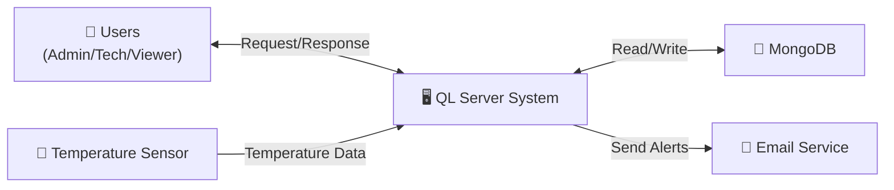
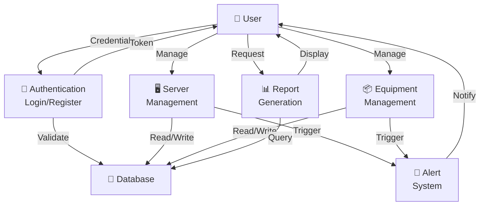
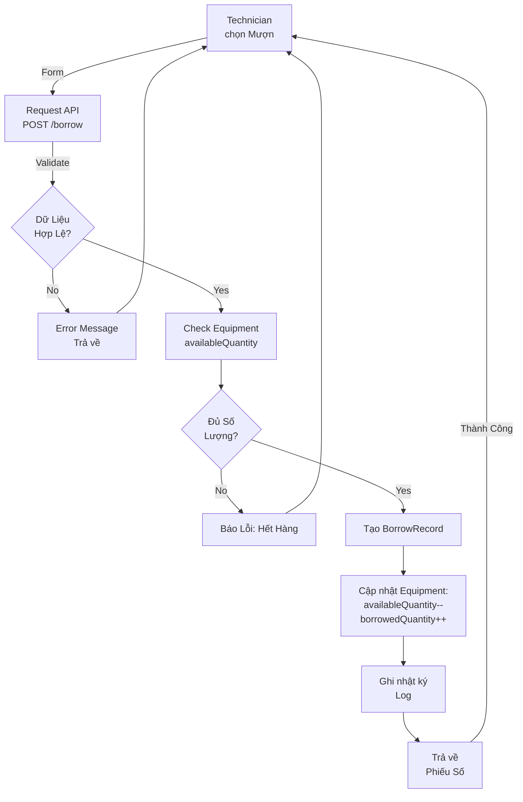
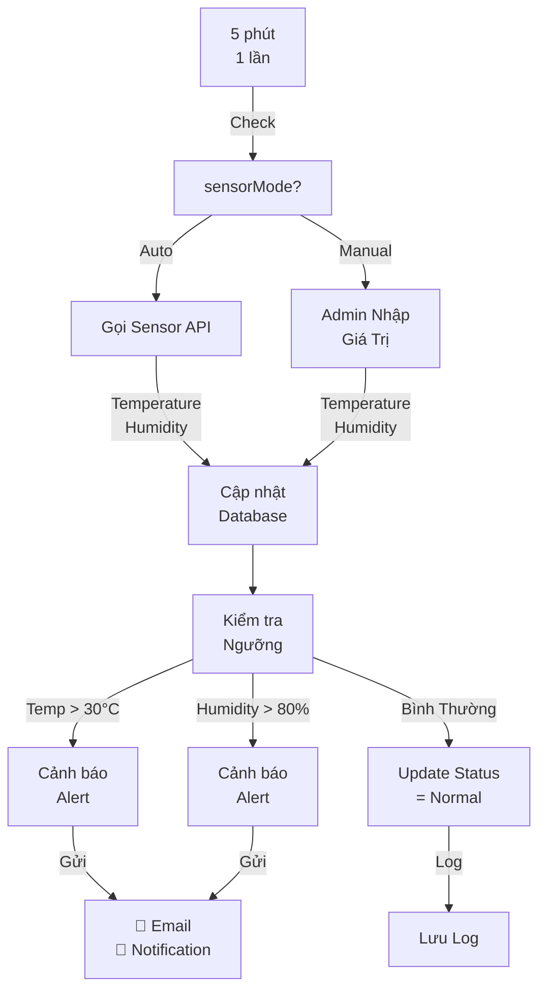

# CHI TIẾT USE CASE VÀ DATA FLOW DIAGRAM

## I. DANH SÁCH CHI TIẾT CÁC USE CASE

### 1. USE CASE: QUẢN LÝ PHÒNG SERVER

#### UC2.1: Xem Danh Sách Phòng Server
**Actors:** Admin, Technician
**Precondition:** Đã đăng nhập
**Main Flow:**
1. User chọn menu "Phòng Server"
2. System lấy danh sách ServerRoom từ database
3. Hiển thị các trường: roomCode, roomName, temperature, humidity, status
4. User có thể filter theo status hoặc search theo roomName

**Postcondition:** Danh sách được hiển thị

#### UC2.2: Thêm Phòng Server Mới
**Actors:** Admin
**Precondition:** Đã đăng nhập với quyền Admin
**Main Flow:**
1. User nhấp "Thêm Phòng"
2. Form hiện lên yêu cầu: roomCode, roomName, area, location, sensorMode
3. User nhập dữ liệu
4. System validate: roomCode phải duy nhất, fields bắt buộc
5. Nếu hợp lệ → lưu vào database
6. Hiển thị thông báo thành công

**Postcondition:** Phòng server mới được tạo

#### UC2.3: Cập Nhật Trạng Thái Phòng (Temperature/Humidity)
**Actors:** System (auto), Admin (manual)
**Precondition:** Phòng server tồn tại
**Main Flow:**
1. Nếu sensorMode = "auto":
   - System gọi sensor API mỗi 5 phút
   - Cập nhật temperature, humidity, powerConsumption
   - Kiểm tra nếu temperature > ngưỡng → status = "warning"
2. Nếu sensorMode = "manual":
   - Admin nhập giá trị thủ công
3. Lưu vào database

**Postcondition:** Trạng thái phòng được cập nhật, gửi alert nếu cần

---

### 2. USE CASE: QUẢN LÝ SERVER

#### UC3.1: Xem Danh Sách Server
**Actors:** Admin, Technician, Viewer
**Precondition:** Đã đăng nhập
**Main Flow:**
1. User chọn "Servers"
2. System query: SELECT * FROM Server (với pagination)
3. Hiển thị: serverCode, serverName, status, ipAddress, rack info
4. Có thể filter theo status (online/offline/maintenance) và search

**Postcondition:** Danh sách hiển thị

#### UC3.2: Thêm Server Mới
**Actors:** Admin
**Precondition:** Admin đã đăng nhập, Rack tồn tại
**Main Flow:**
1. Admin chọn "Thêm Server"
2. Form yêu cầu: serverCode, serverName, cpu, ram, storage, ipAddress, os
3. Admin chọn Rack và vị trí
4. System validate: serverCode unique, required fields
5. Lưu server record
6. Cập nhật Rack (maxDevices giảm)

**Postcondition:** Server mới được tạo trong Rack

#### UC3.3: Cập Nhật Trạng Thái Server
**Actors:** Technician, System
**Precondition:** Server tồn tại
**Main Flow:**
1. Technician hoặc System (health check) cập nhật status
2. Gửi PUT /api/servers/:id {status: "online/offline/maintenance"}
3. Server lưu vào database
4. Nếu status = "offline" → gửi alert

**Postcondition:** Trạng thái server cập nhật, có thể gửi notification

---

### 3. USE CASE: QUẢN LÝ THIẾT BỊ MỰC VỤNG

#### UC6.1: Thêm Thiết Bị Mới
**Actors:** Admin
**Precondition:** Admin đã đăng nhập, ServerRoom tồn tại
**Main Flow:**
1. Admin chọn "Thêm Thiết Bị"
2. Form yêu cầu: equipmentCode, equipmentName, category, quantity, room
3. Validate: equipmentCode unique, quantity > 0
4. availableQuantity = quantity (ban đầu)
5. Lưu Equipment record

**Postcondition:** Thiết bị được thêm vào hệ thống

#### UC6.2: Tạo Phiếu Mượn
**Actors:** Technician
**Precondition:** Đã đăng nhập, Equipment có sẵn, availableQuantity >= quantity yêu cầu
**Main Flow:**
1. Technician chọn "Tạo Phiếu Mượn"
2. Form yêu cầu: equipment, quantity, expectedReturnDate, usageType, notes
3. System generate borrowNumber (BRW-YYYYMMDD-XXX)
4. Validate: availableQuantity >= quantity
5. Tạo BorrowRecord {status: "borrowed"}
6. Cập nhật Equipment:
   - availableQuantity -= quantity
   - borrowedQuantity += quantity
7. Trả về phiếu số

**Postcondition:** Phiếu mượn được tạo, số lượng Equipment giảm

#### UC6.3: Trả Thiết Bị
**Actors:** Technician
**Precondition:** BorrowRecord status = "borrowed"
**Main Flow:**
1. Technician quét mã phiếu hoặc search
2. Chọn "Trả Thiết Bị"
3. Hệ thống hiển thị: tên thiết bị, số lượng, ngày mượn
4. Technician nhập ngày trả thực tế
5. Kiểm tra: nếu actualReturnDate > expectedReturnDate → status = "overdue"
6. Cập nhật BorrowRecord: actualReturnDate, status = "returned"
7. Cập nhật Equipment:
   - availableQuantity += quantity
   - borrowedQuantity -= quantity

**Postcondition:** Phiếu mượn được đóng, thiết bị trả lại kho

---

### 4. USE CASE: QUẢN LÝ BẢOTRÌ

#### UC8.1: Lập Lịch Bảo Trì
**Actors:** Admin
**Precondition:** Admin đã đăng nhập, Server/NetworkDevice tồn tại
**Main Flow:**
1. Admin chọn Server hoặc NetworkDevice
2. Nhấp "Lập Lịch Bảo Trì"
3. Form yêu cầu: scheduledDate, content, expectedCost, notes
4. Validate: scheduledDate phải sau ngày hiện tại
5. Tạo Maintenance record: status = "scheduled"
6. Gửi notification cho Technician

**Postcondition:** Lịch bảo trì được tạo

#### UC8.2: Cập Nhật Bảo Trì (In Progress)
**Actors:** Technician
**Precondition:** Maintenance status = "scheduled"
**Main Flow:**
1. Technician xem lịch bảo trì
2. Nhấp "Bắt Đầu Bảo Trì"
3. System cập nhật: status = "in_progress", performedBy = user._id
4. Hiển thị: content, notes fields để technician nhập thêm

**Postcondition:** Bảo trì bắt đầu

#### UC8.3: Hoàn Thành Bảo Trì
**Actors:** Technician
**Precondition:** Maintenance status = "in_progress"
**Main Flow:**
1. Technician nhập: actualCost (nếu khác dự kiến), finalNotes, resolution
2. Nhấp "Hoàn Thành"
3. System cập nhật:
   - status = "completed"
   - completedDate = now
   - Nếu là Server → cập nhật Server.status = "online"
4. Trả về notification cho Admin

**Postcondition:** Bảo trì hoàn thành, thiết bị trở lại online

---

### 5. USE CASE: QUẢN LÝ SỰ CỐ

#### UC9.1: Báo Cáo Sự Cố
**Actors:** Technician
**Precondition:** Đã đăng nhập, Server tồn tại
**Main Flow:**
1. Technician chọn "Báo Cáo Sự Cố"
2. Form yêu cầu: server, title, description, severity
3. Validate: title, description bắt buộc
4. Tạo Incident record:
   - reportedBy = user._id
   - status = "pending"
   - severity = technician chọn
5. Gửi notification cho Admin
6. Trả về incident ID

**Postcondition:** Sự cố được ghi nhận

#### UC9.2: Gán Sự Cố
**Actors:** Admin
**Precondition:** Incident status = "pending"
**Main Flow:**
1. Admin xem danh sách sự cố
2. Chọn 1 sự cố
3. Chọn technician để gán
4. Cập nhật: assignedTo = technician._id
5. Gửi notification cho technician được gán

**Postcondition:** Sự cố được gán

#### UC9.3: Giải Quyết Sự Cố
**Actors:** Technician
**Precondition:** Incident assignedTo = user._id
**Main Flow:**
1. Technician nhập resolution (cách sửa)
2. Chọn severity mới (nếu khác)
3. Nhấp "Giải Quyết"
4. System cập nhật:
   - status = "resolved"
   - resolution = input
   - resolvedAt = now
5. Trả về notification cho reportedBy user

**Postcondition:** Sự cố được đóng

---

### 6. USE CASE: XEM BÁO CÁO & DASHBOARD

#### UC10.1: Xem Dashboard
**Actors:** Admin, Technician, Viewer
**Precondition:** Đã đăng nhập
**Main Flow:**
1. User đăng nhập → được chuyển đến Dashboard
2. Dashboard hiển thị:
   - Tổng số server (online/offline/maintenance)
   - Tổng thiết bị
   - Nhiệt độ phòng trung bình
   - Số sự cố chưa giải quyết
   - Lịch bảo trì sắp tới
3. Có thể filter theo ngày

**Postcondition:** Dashboard được hiển thị

#### UC10.2: Xuất Báo Cáo
**Actors:** Admin, Technician
**Precondition:** Có dữ liệu
**Main Flow:**
1. User chọn "Báo Cáo" → chọn loại (Server, Incidents, Maintenance)
2. Chọn date range
3. Nhấp "Xuất PDF/Excel"
4. System sinh báo cáo từ database
5. Download file

**Postcondition:** Báo cáo được tải

---

## II. DATA FLOW DIAGRAM (DFD)

### 2.1. DFD Level 0 (System Context)



### 2.2. DFD Level 1: Luồng Chính



### 2.3. DFD: Luồng Tạo Phiếu Mượn Chi Tiết



### 2.4. DFD: Luồng Cập Nhật Trạng Thái Phòng



---

## III. DATABASE SCHEMA (Collection định nghĩa)

### User Collection
```javascript
{
  _id: ObjectId,
  fullName: String,
  email: String (unique),
  password: String (hashed),
  role: String (enum: ["admin", "technician", "viewer"]),
  isActive: Boolean,
  createdAt: Date,
  updatedAt: Date
}
```

### ServerRoom Collection
```javascript
{
  _id: ObjectId,
  roomCode: String (unique),
  roomName: String,
  area: Number,
  temperature: Number,
  humidity: Number,
  powerConsumption: Number,
  acStatus: String (enum: ["on", "off", "maintenance"]),
  sensorMode: String (enum: ["auto", "manual"]),
  status: String (enum: ["normal", "warning", "critical"]),
  location: String,
  lastSensorAt: Date,
  createdAt: Date,
  updatedAt: Date
}
```

### Server Collection
```javascript
{
  _id: ObjectId,
  serverCode: String (unique),
  serverName: String,
  cpu: String,
  ram: String,
  storage: String,
  ipAddress: String,
  os: String,
  installDate: Date,
  status: String (enum: ["online", "offline", "maintenance"]),
  rack: ObjectId (ref: Rack),
  rackPosition: Number,
  notes: String,
  createdAt: Date,
  updatedAt: Date
}
```

### Equipment Collection
```javascript
{
  _id: ObjectId,
  equipmentCode: String (unique),
  equipmentName: String,
  category: String (enum: [...]),
  description: String,
  quantity: Number,
  availableQuantity: Number,
  borrowedQuantity: Number,
  room: ObjectId (ref: ServerRoom),
  status: String (enum: ["available", "in_stock", "damaged", "lost"]),
  purchaseDate: Date,
  notes: String,
  createdAt: Date,
  updatedAt: Date
}
```

### BorrowRecord Collection
```javascript
{
  _id: ObjectId,
  borrowNumber: String (unique),
  equipment: ObjectId (ref: Equipment),
  room: ObjectId (ref: ServerRoom),
  borrowedBy: String,
  quantity: Number,
  borrowDate: Date,
  expectedReturnDate: Date,
  actualReturnDate: Date,
  status: String (enum: ["borrowed", "returned", "overdue", "lost"]),
  usageType: String (enum: ["use", "install", "borrow"]),
  notes: String,
  approvedBy: ObjectId (ref: User),
  createdAt: Date,
  updatedAt: Date
}
```

### Incident Collection
```javascript
{
  _id: ObjectId,
  server: ObjectId (ref: Server),
  reportedBy: ObjectId (ref: User),
  assignedTo: ObjectId (ref: User),
  title: String,
  description: String,
  severity: String (enum: ["low", "medium", "high", "critical"]),
  status: String (enum: ["pending", "in_progress", "resolved"]),
  resolution: String,
  resolvedAt: Date,
  createdAt: Date,
  updatedAt: Date
}
```

### Maintenance Collection
```javascript
{
  _id: ObjectId,
  server: ObjectId (ref: Server),
  networkDevice: ObjectId (ref: NetworkDevice),
  performedBy: ObjectId (ref: User),
  scheduledDate: Date,
  completedDate: Date,
  content: String,
  cost: Number,
  status: String (enum: ["scheduled", "in_progress", "completed", "cancelled"]),
  notes: String,
  createdAt: Date,
  updatedAt: Date
}
```

---

## IV. API ENDPOINTS MAP

```
Authentication:
  POST   /api/auth/login                    → Login
  POST   /api/auth/logout                   → Logout
  POST   /api/auth/register                 → Register (Admin only)
  
ServerRoom:
  GET    /api/rooms                         → Danh sách
  GET    /api/rooms/:id                     → Chi tiết
  POST   /api/rooms                         → Tạo mới
  PUT    /api/rooms/:id                     → Cập nhật
  DELETE /api/rooms/:id                     → Xóa
  
Server:
  GET    /api/servers                       → Danh sách
  GET    /api/servers/:id                   → Chi tiết
  POST   /api/servers                       → Tạo mới
  PUT    /api/servers/:id                   → Cập nhật
  DELETE /api/servers/:id                   → Xóa
  
Equipment:
  GET    /api/equipment                     → Danh sách
  GET    /api/equipment/:id                 → Chi tiết
  POST   /api/equipment                     → Tạo mới
  PUT    /api/equipment/:id                 → Cập nhật
  DELETE /api/equipment/:id                 → Xóa
  
BorrowRecord:
  GET    /api/borrow-records                → Danh sách
  GET    /api/borrow-records/:id            → Chi tiết
  POST   /api/borrow-records                → Tạo phiếu
  PUT    /api/borrow-records/:id/return     → Trả hàng
  
Incident:
  GET    /api/incidents                     → Danh sách
  GET    /api/incidents/:id                 → Chi tiết
  POST   /api/incidents                     → Báo cáo
  PUT    /api/incidents/:id                 → Cập nhật/Gán
  
Maintenance:
  GET    /api/maintenance                   → Danh sách
  GET    /api/maintenance/:id               → Chi tiết
  POST   /api/maintenance                   → Lập lịch
  PUT    /api/maintenance/:id/start         → Bắt đầu
  PUT    /api/maintenance/:id/complete      → Hoàn thành
  
Dashboard:
  GET    /api/dashboard/stats               → Thống kê
  GET    /api/dashboard/alerts              → Cảnh báo
  
Reports:
  GET    /api/reports/servers               → Báo cáo server
  GET    /api/reports/incidents             → Báo cáo sự cố
  GET    /api/reports/maintenance           → Báo cáo bảo trì
  POST   /api/reports/export                → Xuất PDF/Excel
```

---

## V. STATE MACHINE DIAGRAMS

### 5.1. Server Status State Machine

```
┌─────────┐
│ offline │
└────┬────┘
     │
     ├─→ (khi online) ──→ ┌────────┐
     │                    │ online │
     │                    └───┬────┘
     │                        │
     │    ┌─────────────┐     │
     └─→  │ maintenance │ ←──┤
          └────┬────────┘     │
               │              │
               └──→ online ───┘
```

### 5.2. Incident Status State Machine

```
┌─────────┐
│ pending │
└────┬────┘
     │
     └─→ (gán cho tech) ──→ ┌───────────┐
                            │in_progress│
                            └─────┬─────┘
                                  │
                                  └─→ (xử lý xong) ──→ ┌──────────┐
                                                       │ resolved │
                                                       └──────────┘
```

### 5.3. BorrowRecord Status State Machine

```
┌─────────┐
│borrowed │
└────┬────┘
     │
     ├─→ (trả đúng hạn) ──→ ┌─────────┐
     │                      │returned │
     │                      └─────────┘
     │
     └─→ (quá hạn) ──→ ┌────────┐
                       │ overdue│
                       └───┬────┘
                           │
                           ├─→ (trả sau) ──→ returned
                           │
                           └─→ (mất) ──→ ┌─────┐
                                         │ lost│
                                         └─────┘
```

---

## VI. SEQUENCE DIAGRAM

### 6.1. Sequence: Tạo Phiếu Mượn

```
Technician     System        Database      Email
    │              │             │           │
    ├─ Request ───→│             │           │
    │              ├─ Validate ──→│           │
    │              │←─ OK ────────┤           │
    │              │              │           │
    │              ├─ Create ────→│           │
    │              │←─ Success ───┤           │
    │              │              │           │
    │              ├─ Update ────→│           │
    │              │←─ OK ────────┤           │
    │              │              │           │
    │              ├─ Send Email ─────────→│
    │              │                       │
    │←─ Phiếu Số ──┤                       │
    │              │                       │
```

### 6.2. Sequence: Báo Cáo Sự Cố và Gán

```
Technician     System      Database    Admin        Email
    │             │           │         │            │
    ├─ Report ────→│           │         │            │
    │              ├─ Create ──→│        │            │
    │              │←─ OK ──────┤        │            │
    │              │            │        │            │
    │              ├─ Notify ────────────→│           │
    │              │            │        ├─ Alert ──→│
    │              │            │        │            │
    │              │            │        │            │
    │←─ Success ───┤            │        │            │
    │              │            │        │            │
    │              │            │        ├─ Read ────→│
    │              │            │        │            │
    │              │            │ ←─ Gán ├───────────┤
    │              ├─ Update ───→│        │            │
    │              │←─ OK ──────┤        │            │
    │              │            │        │            │
    │              ├─ Notify ───────→│   │            │
    │              │            │    ├─ Alert ──────→│
    │              │            │    │   │            │
```

---

## VII. TÓM TẮT QUAN HỆ ENTITY

| Entity 1 | Quan Hệ | Entity 2 | Cardinality |
|----------|---------|----------|------------|
| User | báo cáo | Incident | 1:N |
| User | gán | Incident | 1:N |
| User | thực hiện | Maintenance | 1:N |
| User | phê duyệt | BorrowRecord | 1:N |
| ServerRoom | chứa | Rack | 1:N |
| ServerRoom | chứa | Equipment | 1:N |
| ServerRoom | chứa | NetworkDevice | 1:N |
| ServerRoom | quản lý | BorrowRecord | 1:N |
| Rack | chứa | Server | 1:N |
| Server | có | Incident | 1:N |
| Server | bảo trì | Maintenance | 1:N |
| Equipment | mượn | BorrowRecord | 1:N |
| NetworkDevice | bảo trì | Maintenance | 1:N |

---

**Tài liệu này cung cấp chi tiết để bạn vẽ Use Case Diagram, ERD, DFD, và Sequence Diagrams cho hệ thống.**

Bạn có thể sử dụng:
- **Draw.io** (online, miễn phí)
- **Lucidchart** (chuyên dụng)
- **Miro** (cộng tác team)
- **Tờ giấy + bút** (nhanh nhất!)
