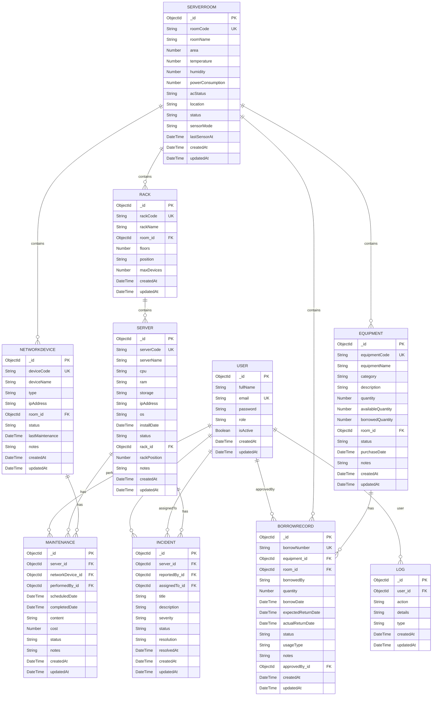

# 📐 ERD DEFINITION - ĐỊNH NGHĨA CHO CÔNG CỤ VẼ DIAGRAM

## 🔧 Format DbDiagram.io / DrawDB

Sao chép toàn bộ nội dung dưới đây vào https://dbdiagram.io hoặc DrawDB để tạo ERD tự động:

```
// User Table
Table users {
  _id ObjectId [primary key]
  fullName String [not null]
  email String [unique, not null]
  password String [not null]
  role String [not null, default: 'technician']
  isActive Boolean [default: true]
  createdAt DateTime [default: `now()`]
  updatedAt DateTime
}

// ServerRoom Table
Table serverrooms {
  _id ObjectId [primary key]
  roomCode String [unique, not null]
  roomName String [not null]
  area Number [default: 0]
  temperature Number [default: 25]
  humidity Number [default: 50]
  powerConsumption Number [default: 0]
  acStatus String [note: 'on, off, maintenance']
  location String [default: '']
  status String [note: 'normal, warning, critical']
  sensorMode String [note: 'auto, manual']
  lastSensorAt DateTime
  createdAt DateTime
  updatedAt DateTime
}

// Rack Table
Table racks {
  _id ObjectId [primary key]
  rackCode String [unique, not null]
  rackName String [not null]
  room_id ObjectId [not null, ref: > serverrooms._id]
  floors Number [default: 42]
  position String [default: '']
  maxDevices Number [default: 42]
  createdAt DateTime
  updatedAt DateTime
}

// Server Table
Table servers {
  _id ObjectId [primary key]
  serverCode String [unique, not null]
  serverName String [not null]
  cpu String [default: '']
  ram String [default: '']
  storage String [default: '']
  ipAddress String [default: '']
  os String [default: '']
  installDate DateTime
  status String [note: 'online, offline, maintenance']
  rack_id ObjectId [ref: > racks._id]
  rackPosition Number [default: 0]
  notes String [default: '']
  createdAt DateTime
  updatedAt DateTime
}

// NetworkDevice Table
Table networkdevices {
  _id ObjectId [primary key]
  deviceCode String [unique, not null]
  deviceName String [not null]
  type String [not null, note: 'router, switch, firewall, ups']
  ipAddress String [default: '']
  room_id ObjectId [ref: > serverrooms._id]
  status String [note: 'online, offline, maintenance']
  lastMaintenance DateTime
  notes String [default: '']
  createdAt DateTime
  updatedAt DateTime
}

// Equipment Table
Table equipments {
  _id ObjectId [primary key]
  equipmentCode String [unique, not null]
  equipmentName String [not null]
  category String [not null]
  description String [default: '']
  quantity Number [not null]
  availableQuantity Number [not null]
  borrowedQuantity Number [default: 0]
  room_id ObjectId [not null, ref: > serverrooms._id]
  status String [note: 'available, in_stock, damaged, lost']
  purchaseDate DateTime
  notes String [default: '']
  createdAt DateTime
  updatedAt DateTime
}

// Maintenance Table
Table maintenances {
  _id ObjectId [primary key]
  server_id ObjectId [ref: > servers._id]
  networkDevice_id ObjectId [ref: > networkdevices._id]
  performedBy_id ObjectId [not null, ref: > users._id]
  scheduledDate DateTime [not null]
  completedDate DateTime
  content String [not null]
  cost Number [default: 0]
  status String [note: 'scheduled, in_progress, completed, cancelled']
  notes String [default: '']
  createdAt DateTime
  updatedAt DateTime
}

// Incident Table
Table incidents {
  _id ObjectId [primary key]
  server_id ObjectId [ref: > servers._id]
  reportedBy_id ObjectId [not null, ref: > users._id]
  assignedTo_id ObjectId [ref: > users._id]
  title String [not null]
  description String [not null]
  severity String [note: 'low, medium, high, critical']
  status String [note: 'pending, in_progress, resolved']
  resolution String [default: '']
  resolvedAt DateTime
  createdAt DateTime
  updatedAt DateTime
}

// BorrowRecord Table
Table borrowrecords {
  _id ObjectId [primary key]
  borrowNumber String [unique, not null]
  equipment_id ObjectId [not null, ref: > equipments._id]
  room_id ObjectId [not null, ref: > serverrooms._id]
  borrowedBy String [not null]
  quantity Number [not null]
  borrowDate DateTime [default: `now()`]
  expectedReturnDate DateTime
  actualReturnDate DateTime
  status String [note: 'borrowed, returned, overdue, lost']
  usageType String [note: 'use, install, borrow']
  notes String [default: '']
  approvedBy_id ObjectId [ref: > users._id]
  createdAt DateTime
  updatedAt DateTime
}

// Log Table
Table logs {
  _id ObjectId [primary key]
  user_id ObjectId [ref: > users._id]
  action String [not null]
  details String [default: '']
  type String [note: 'login, operation, error, system']
  createdAt DateTime
  updatedAt DateTime
}

// Relationships
Ref: racks.room_id > serverrooms._id
Ref: servers.rack_id > racks._id
Ref: networkdevices.room_id > serverrooms._id
Ref: equipments.room_id > serverrooms._id
Ref: borrowrecords.equipment_id > equipments._id
Ref: borrowrecords.room_id > serverrooms._id
Ref: maintenances.server_id > servers._id
Ref: maintenances.networkDevice_id > networkdevices._id
Ref: maintenances.performedBy_id > users._id
Ref: incidents.server_id > servers._id
Ref: incidents.reportedBy_id > users._id
Ref: incidents.assignedTo_id > users._id
Ref: borrowrecords.approvedBy_id > users._id
Ref: logs.user_id > users._id
```

---

## 📊 Format Mermaid Diagram



---

## 🗂️ Danh sách các Fields theo từng Entity (CSV Format)

### USER
```
EntityName,FieldName,DataType,Constraint,DefaultValue,Description
USER,_id,ObjectId,PRIMARY KEY,,ID duy nhất
USER,fullName,String,NOT NULL,,Họ tên đầy đủ
USER,email,String,"NOT NULL, UNIQUE",,Email duy nhất
USER,password,String,"NOT NULL, MIN(6)",,Mật khẩu mã hóa
USER,role,String,"ENUM: admin|technician|viewer",technician,Quyền hạn
USER,isActive,Boolean,DEFAULT,true,Trạng thái kích hoạt
USER,createdAt,DateTime,AUTO,,Thời gian tạo
USER,updatedAt,DateTime,AUTO,,Thời gian cập nhật
```

### SERVERROOM
```
EntityName,FieldName,DataType,Constraint,DefaultValue,Description
SERVERROOM,_id,ObjectId,PRIMARY KEY,,ID duy nhất
SERVERROOM,roomCode,String,"UNIQUE, NOT NULL",,Mã phòng
SERVERROOM,roomName,String,NOT NULL,,Tên phòng
SERVERROOM,area,Number,DEFAULT,0,Diện tích (m²)
SERVERROOM,temperature,Number,DEFAULT,25,Nhiệt độ (°C)
SERVERROOM,humidity,Number,DEFAULT,50,Độ ẩm (%)
SERVERROOM,powerConsumption,Number,DEFAULT,0,Tiêu thụ điện (W)
SERVERROOM,acStatus,String,"ENUM: on|off|maintenance",on,Trạng thái AC
SERVERROOM,location,String,DEFAULT,"",Vị trí
SERVERROOM,status,String,"ENUM: normal|warning|critical",normal,Trạng thái phòng
SERVERROOM,sensorMode,String,"ENUM: auto|manual",auto,Chế độ cảm biến
SERVERROOM,lastSensorAt,DateTime,OPTIONAL,,Lần đọc cuối
SERVERROOM,createdAt,DateTime,AUTO,,Thời gian tạo
SERVERROOM,updatedAt,DateTime,AUTO,,Thời gian cập nhật
```

### RACK
```
EntityName,FieldName,DataType,Constraint,DefaultValue,Description
RACK,_id,ObjectId,PRIMARY KEY,,ID duy nhất
RACK,rackCode,String,"UNIQUE, NOT NULL",,Mã rack
RACK,rackName,String,NOT NULL,,Tên rack
RACK,room,ObjectId,"REF: SERVERROOM, NOT NULL",,ID phòng chứa
RACK,floors,Number,DEFAULT,42,Số U
RACK,position,String,DEFAULT,"",Vị trí trong phòng
RACK,maxDevices,Number,DEFAULT,42,Số thiết bị tối đa
RACK,createdAt,DateTime,AUTO,,Thời gian tạo
RACK,updatedAt,DateTime,AUTO,,Thời gian cập nhật
```

### SERVER
```
EntityName,FieldName,DataType,Constraint,DefaultValue,Description
SERVER,_id,ObjectId,PRIMARY KEY,,ID duy nhất
SERVER,serverCode,String,"UNIQUE, NOT NULL",,Mã server
SERVER,serverName,String,NOT NULL,,Tên server
SERVER,cpu,String,DEFAULT,"",Loại CPU
SERVER,ram,String,DEFAULT,"",Dung lượng RAM
SERVER,storage,String,DEFAULT,"",Ổ cứng
SERVER,ipAddress,String,DEFAULT,"",Địa chỉ IP
SERVER,os,String,DEFAULT,"",Hệ điều hành
SERVER,installDate,DateTime,DEFAULT,now(),Ngày cài đặt
SERVER,status,String,"ENUM: online|offline|maintenance",offline,Trạng thái
SERVER,rack,ObjectId,"REF: RACK, OPTIONAL",,ID rack chứa
SERVER,rackPosition,Number,DEFAULT,0,Vị trí trong rack
SERVER,notes,String,DEFAULT,"",Ghi chú
SERVER,createdAt,DateTime,AUTO,,Thời gian tạo
SERVER,updatedAt,DateTime,AUTO,,Thời gian cập nhật
```

### NETWORKDEVICE
```
EntityName,FieldName,DataType,Constraint,DefaultValue,Description
NETWORKDEVICE,_id,ObjectId,PRIMARY KEY,,ID duy nhất
NETWORKDEVICE,deviceCode,String,"UNIQUE, NOT NULL",,Mã thiết bị
NETWORKDEVICE,deviceName,String,NOT NULL,,Tên thiết bị
NETWORKDEVICE,type,String,"ENUM: router|switch|firewall|ups, NOT NULL",,Loại thiết bị
NETWORKDEVICE,ipAddress,String,DEFAULT,"",Địa chỉ IP
NETWORKDEVICE,room,ObjectId,"REF: SERVERROOM, OPTIONAL",,ID phòng chứa
NETWORKDEVICE,status,String,"ENUM: online|offline|maintenance",online,Trạng thái
NETWORKDEVICE,lastMaintenance,DateTime,OPTIONAL,,Lần bảo trì cuối
NETWORKDEVICE,notes,String,DEFAULT,"",Ghi chú
NETWORKDEVICE,createdAt,DateTime,AUTO,,Thời gian tạo
NETWORKDEVICE,updatedAt,DateTime,AUTO,,Thời gian cập nhật
```

### EQUIPMENT
```
EntityName,FieldName,DataType,Constraint,DefaultValue,Description
EQUIPMENT,_id,ObjectId,PRIMARY KEY,,ID duy nhất
EQUIPMENT,equipmentCode,String,"UNIQUE, NOT NULL",,Mã thiết bị
EQUIPMENT,equipmentName,String,NOT NULL,,Tên thiết bị
EQUIPMENT,category,String,"ENUM: mouse|keyboard|monitor|headset|cable|power_supply|cpu_case|network_switch|speaker|printer_ink|network_card|scanner|other, NOT NULL",,Loại thiết bị
EQUIPMENT,description,String,DEFAULT,"",Mô tả
EQUIPMENT,quantity,Number,"NOT NULL, MIN: 0",,Tổng số lượng
EQUIPMENT,availableQuantity,Number,"NOT NULL, MIN: 0",,Số lượng có sẵn
EQUIPMENT,borrowedQuantity,Number,"DEFAULT, MIN: 0",0,Số lượng đang mượn
EQUIPMENT,room,ObjectId,"REF: SERVERROOM, NOT NULL",,ID phòng lưu trữ
EQUIPMENT,status,String,"ENUM: available|in_stock|damaged|lost",available,Trạng thái
EQUIPMENT,purchaseDate,DateTime,DEFAULT,now(),Ngày mua
EQUIPMENT,notes,String,DEFAULT,"",Ghi chú
EQUIPMENT,createdAt,DateTime,AUTO,,Thời gian tạo
EQUIPMENT,updatedAt,DateTime,AUTO,,Thời gian cập nhật
```

### MAINTENANCE
```
EntityName,FieldName,DataType,Constraint,DefaultValue,Description
MAINTENANCE,_id,ObjectId,PRIMARY KEY,,ID duy nhất
MAINTENANCE,server,ObjectId,"REF: SERVER, OPTIONAL",,ID server bảo trì
MAINTENANCE,networkDevice,ObjectId,"REF: NETWORKDEVICE, OPTIONAL",,ID device bảo trì
MAINTENANCE,performedBy,ObjectId,"REF: USER, NOT NULL",,Người thực hiện
MAINTENANCE,scheduledDate,DateTime,NOT NULL,,Ngày lên lịch
MAINTENANCE,completedDate,DateTime,OPTIONAL,,Ngày hoàn thành
MAINTENANCE,content,String,NOT NULL,,Nội dung bảo trì
MAINTENANCE,cost,Number,DEFAULT,0,Chi phí (VND)
MAINTENANCE,status,String,"ENUM: scheduled|in_progress|completed|cancelled",scheduled,Trạng thái
MAINTENANCE,notes,String,DEFAULT,"",Ghi chú
MAINTENANCE,createdAt,DateTime,AUTO,,Thời gian tạo
MAINTENANCE,updatedAt,DateTime,AUTO,,Thời gian cập nhật
```

### INCIDENT
```
EntityName,FieldName,DataType,Constraint,DefaultValue,Description
INCIDENT,_id,ObjectId,PRIMARY KEY,,ID duy nhất
INCIDENT,server,ObjectId,"REF: SERVER, OPTIONAL",,ID server gặp sự cố
INCIDENT,reportedBy,ObjectId,"REF: USER, NOT NULL",,Người báo cáo
INCIDENT,assignedTo,ObjectId,"REF: USER, OPTIONAL",,Người xử lý
INCIDENT,title,String,NOT NULL,,Tiêu đề
INCIDENT,description,String,NOT NULL,,Mô tả chi tiết
INCIDENT,severity,String,"ENUM: low|medium|high|critical",medium,Mức độ
INCIDENT,status,String,"ENUM: pending|in_progress|resolved",pending,Trạng thái
INCIDENT,resolution,String,DEFAULT,"",Giải pháp
INCIDENT,resolvedAt,DateTime,OPTIONAL,,Thời gian giải quyết
INCIDENT,createdAt,DateTime,AUTO,,Thời gian tạo
INCIDENT,updatedAt,DateTime,AUTO,,Thời gian cập nhật
```

### BORROWRECORD
```
EntityName,FieldName,DataType,Constraint,DefaultValue,Description
BORROWRECORD,_id,ObjectId,PRIMARY KEY,,ID duy nhất
BORROWRECORD,borrowNumber,String,"UNIQUE, NOT NULL",,Số hiệu mượn
BORROWRECORD,equipment,ObjectId,"REF: EQUIPMENT, NOT NULL",,ID thiết bị
BORROWRECORD,room,ObjectId,"REF: SERVERROOM, NOT NULL",,ID phòng mượn
BORROWRECORD,borrowedBy,String,NOT NULL,,Tên người mượn
BORROWRECORD,quantity,Number,"NOT NULL, MIN: 1",,Số lượng mượn
BORROWRECORD,borrowDate,DateTime,DEFAULT,now(),Ngày mượn
BORROWRECORD,expectedReturnDate,DateTime,OPTIONAL,,Ngày dự kiến trả
BORROWRECORD,actualReturnDate,DateTime,OPTIONAL,,Ngày trả thực tế
BORROWRECORD,status,String,"ENUM: borrowed|returned|overdue|lost",borrowed,Trạng thái
BORROWRECORD,usageType,String,"ENUM: use|install|borrow",use,Loại sử dụng
BORROWRECORD,notes,String,DEFAULT,"",Ghi chú
BORROWRECORD,approvedBy,ObjectId,"REF: USER, OPTIONAL",,Người phê duyệt
BORROWRECORD,createdAt,DateTime,AUTO,,Thời gian tạo
BORROWRECORD,updatedAt,DateTime,AUTO,,Thời gian cập nhật
```

### LOG
```
EntityName,FieldName,DataType,Constraint,DefaultValue,Description
LOG,_id,ObjectId,PRIMARY KEY,,ID duy nhất
LOG,user,ObjectId,"REF: USER, OPTIONAL",,ID người dùng
LOG,action,String,NOT NULL,,Tên hành động
LOG,details,String,DEFAULT,"",Chi tiết
LOG,type,String,"ENUM: login|operation|error|system",operation,Loại log
LOG,createdAt,DateTime,AUTO,,Thời gian tạo
LOG,updatedAt,DateTime,AUTO,,Thời gian cập nhật
```

---

## 📋 Tổng Hợp Relationships

| Parent | Child | Cardinality | Foreign Key | Type |
|--------|-------|-------------|------------|------|
| USER | INCIDENT | 1:N | reportedBy | Referenced |
| USER | INCIDENT | 1:N | assignedTo | Referenced |
| USER | MAINTENANCE | 1:N | performedBy | Referenced |
| USER | BORROWRECORD | 1:N | approvedBy | Referenced |
| USER | LOG | 1:N | user | Referenced |
| SERVERROOM | RACK | 1:N | room | Embedded |
| SERVERROOM | NETWORKDEVICE | 1:N | room | Referenced |
| SERVERROOM | EQUIPMENT | 1:N | room | Referenced |
| SERVERROOM | BORROWRECORD | 1:N | room | Referenced |
| RACK | SERVER | 1:N | rack | Referenced |
| SERVER | MAINTENANCE | 1:N | server | Referenced |
| SERVER | INCIDENT | 1:N | server | Referenced |
| NETWORKDEVICE | MAINTENANCE | 1:N | networkDevice | Referenced |
| EQUIPMENT | BORROWRECORD | 1:N | equipment | Referenced |

---

## 🔑 Enum Values Reference

**USER.role**: 
- admin
- technician
- viewer

**SERVERROOM.acStatus**: 
- on
- off
- maintenance

**SERVERROOM.status**: 
- normal
- warning
- critical

**SERVERROOM.sensorMode**: 
- auto (hệ thống đọc cảm biến)
- manual (nhập tay)

**SERVER.status / NETWORKDEVICE.status**: 
- online
- offline
- maintenance

**NETWORKDEVICE.type**: 
- router
- switch
- firewall
- ups

**EQUIPMENT.category**: 
- mouse
- keyboard
- monitor
- headset
- cable
- power_supply
- cpu_case
- network_switch
- speaker
- printer_ink
- network_card
- scanner
- other

**EQUIPMENT.status**: 
- available
- in_stock
- damaged
- lost

**MAINTENANCE.status**: 
- scheduled
- in_progress
- completed
- cancelled

**INCIDENT.severity**: 
- low
- medium
- high
- critical

**INCIDENT.status**: 
- pending
- in_progress
- resolved

**BORROWRECORD.status**: 
- borrowed
- returned
- overdue
- lost

**BORROWRECORD.usageType**: 
- use
- install
- borrow

**LOG.type**: 
- login
- operation
- error
- system

