# HƯỚNG DẪN CHI TIẾT VẼ CÁC LOẠI DIAGRAM

## I. HƯỚNG DẪN VẼ USE CASE DIAGRAM

### 1.1. Các Thành Phần USE CASE Diagram

```
┌─────────────────────────────────────────────────────┐
│           Use Case Diagram Elements                 │
├─────────────────────────────────────────────────────┤
│                                                     │
│  1. Actor: Vẽ hình "đầu que diêu" (stick figure)  │
│     ┌─────┐  hoặc  👤                              │
│     │ ◯   │                                         │
│    /│\    │                                         │
│     │ ╱╲  │                                         │
│                                                     │
│  2. Use Case: Hình bầu dục (ellipse)               │
│     ┌─────────────────┐                            │
│     │  Use Case Name  │                            │
│     └─────────────────┘                            │
│                                                     │
│  3. System Boundary: Hình chữ nhật lớn             │
│     ┌──────────────────────────────┐               │
│     │        System Name            │               │
│     │ ┌────────────────────────┐   │               │
│     │ │   Use Case 1           │   │               │
│     │ └────────────────────────┘   │               │
│     └──────────────────────────────┘               │
│                                                     │
│  4. Relationships:                                  │
│     Actor →[associated] → Use Case                 │
│     Use Case --<<include>>-- → Use Case            │
│     Use Case --<<extend>>-- → Use Case             │
│                                                     │
└─────────────────────────────────────────────────────┘
```

### 1.2. Các Loại Relationships

#### 2.1. Association (Liên Kết)
- **Mô tả**: Actor thực hiện Use Case
- **Ký hiệu**: Đường solid với mũi tên
- **Ví dụ**:
```
  Admin
    │
    └─→ [Quản lý Server]
```

#### 2.2. Include (Bắt Buộc)
- **Mô tả**: Use Case A gọi Use Case B bắt buộc
- **Ký hiệu**: Đường solid, ghi `<<include>>`
- **Ví dụ**:
```
  [Trả thiết bị] ──<<include>>── [Cập nhật Equipment]
```
Khi Trả thiết bị → luôn gọi Cập nhật Equipment

#### 2.3. Extend (Mở Rộng)
- **Mô tả**: Use Case B có thể được gọi tùy chọn từ A
- **Ký hiệu**: Đường solid, ghi `<<extend>>`
- **Ví dụ**:
```
  [Tạo Incident] ──<<extend>>── [Gửi Email Alert]
```
Khi tạo Incident → có thể gửi email

#### 2.4. Generalization (Kế Thừa)
- **Mô tả**: Actor con kế thừa quyền từ Actor cha
- **Ký hiệu**: Đường solid, mũi tên tam giác
- **Ví dụ**:
```
  Admin ---|► User
  Technician ---|► User
  Viewer ---|► User
```

### 1.3. Quy Tắc Vẽ Use Case Diagram

**Quy tắc 1: Đặt Actors bên ngoài System Boundary**
```
✅ Đúng:                    ❌ Sai:
┌──────────────────┐       ┌──────────────────┐
│     System       │       │     System       │
│  ┌────────────┐  │       │ Admin            │
│  │ Use Case 1 │  │       │ ┌────────────┐  │
│  └────────────┘  │       │ │ Use Case 1 │  │
└──────────────────┘       │ └────────────┘  │
         ↑                  └──────────────────┘
      Admin
```

**Quy tắc 2: Dùng danh từ cho Use Case**
```
✅ Đúng:                    ❌ Sai:
[Tạo Server]               [ServerCreating]
[Cập nhật Thiết Bị]        [UpdateEquipmentProcess]
[Xuất Báo Cáo]             [ExportTheReport]
```

**Quy tắc 3: Không vẽ relationships giữa Actors**
```
❌ Sai:
Admin ←→ Technician

✅ Đúng: Actors không kết nối, dù có phân cấp
Admin ---|► User
Technician ---|► User
```

**Quy tắc 4: Đơn Giản Hóa bằng Packages**
Nếu Use Cases quá nhiều, nhóm vào packages:
```
┌─────────────────────────────────┐
│      System                     │
├─────────────────────────────────┤
│ ┌─────────────────────────────┐ │
│ │  Equipment Management       │ │
│ │  ┌──────────────────────┐   │ │
│ │  │ View Equipment List  │   │ │
│ │  └──────────────────────┘   │ │
│ │  ┌──────────────────────┐   │ │
│ │  │ Create New Equipment │   │ │
│ │  └──────────────────────┘   │ │
│ └─────────────────────────────┘ │
│                                 │
│ ┌─────────────────────────────┐ │
│ │  Borrow Management          │ │
│ │  ┌──────────────────────┐   │ │
│ │  │ Create Borrow Record │   │ │
│ │  └──────────────────────┘   │ │
│ │  ┌──────────────────────┐   │ │
│ │  │ Return Equipment     │   │ │
│ │  └──────────────────────┘   │ │
│ └─────────────────────────────┘ │
└─────────────────────────────────┘
```

### 1.4. Ví Dụ Use Case Diagram CHI TIẾT

```mermaid
graph TB
    subgraph System["SYSTEM: Quản Lý Phòng Server"]
        subgraph Auth["🔐 Authentication"]
            UC1["Login"]
            UC2["Logout"]
            UC3["Manage Users"]
        end
        
        subgraph Server["🖥️ Server Management"]
            UC4["View Servers"]
            UC5["Add Server"]
            UC6["Update Server"]
            UC7["Delete Server"]
            UC8["Update Status"]
        end
        
        subgraph Equipment["📦 Equipment Management"]
            UC9["View Equipment"]
            UC10["Add Equipment"]
            UC11["Create Borrow Record"]
            UC12["Return Equipment"]
            UC13["Update Equipment Qty"]
        end
        
        subgraph Report["📊 Reports"]
            UC14["View Dashboard"]
            UC15["Generate Report"]
            UC16["Export PDF"]
        end
    end
    
    subgraph Actors["Actors"]
        Admin["👤 Admin"]
        Tech["👨‍🔧 Technician"]
        Viewer["👁️ Viewer"]
    end
    
    Admin -->|Use| UC1
    Admin -->|Use| UC2
    Admin -->|Use| UC3
    Admin -->|Use| UC4
    Admin -->|Use| UC5
    Admin -->|Use| UC7
    Admin -->|Use| UC9
    Admin -->|Use| UC10
    Admin -->|Use| UC15
    Admin -->|Use| UC16
    
    Tech -->|Use| UC1
    Tech -->|Use| UC2
    Tech -->|Use| UC4
    Tech -->|Use| UC6
    Tech -->|Use| UC8
    Tech -->|Use| UC9
    Tech -->|Use| UC11
    Tech -->|Use| UC12
    Tech -->|Use| UC14
    
    Viewer -->|Use| UC1
    Viewer -->|Use| UC2
    Viewer -->|Use| UC14
    Viewer -->|Use| UC15
    
    UC12 -->|<<include>>| UC13
    UC11 -->|<<include>>| UC13
```



---

## II. HƯỚNG DẪN VẼ ENTITY RELATIONSHIP DIAGRAM (ERD)

### 2.1. Các Thành Phần ERD

```
┌─────────────────────────────────────────────────┐
│           ERD Diagram Elements                  │
├─────────────────────────────────────────────────┤
│                                                 │
│  1. Entity: Hình chữ nhật                       │
│     ┌──────────┐                                │
│     │  ENTITY  │                                │
│     └──────────┘                                │
│                                                 │
│  2. Attributes: Hình oval                       │
│       ○ Attribute1                              │
│       ○ Attribute2                              │
│       ○ PK (Primary Key) gạch dưới              │
│                                                 │
│  3. Relationships: Đường nối                    │
│     [Entity1] ─── [Relationship] ─── [Entity2] │
│                                                 │
│  4. Cardinality Symbols:                        │
│     | (1 và chỉ 1)                             │
│     o (0 hoặc 1)                               │
│     { (0 hoặc nhiều)                           │
│     || (1 hoặc nhiều)                          │
│                                                 │
│     1:1  Entity1 ─ 1 ── 1 ─ Entity2            │
│     1:N  Entity1 ─ 1 ── N ─ Entity2            │
│     N:M  Entity1 ─ N ── M ─ Entity2            │
│                                                 │
└─────────────────────────────────────────────────┘
```

### 2.2. Cardinality Notation

#### Crow's Foot Notation (Phổ biến nhất)

```
┌─────────────────────────────────────────┐
│      Crow's Foot Cardinality            │
├─────────────────────────────────────────┤
│                                         │
│  Zero or One:        o|                 │
│  Exactly One:        ||                 │
│  Zero or Many:       o{                 │
│  One or Many:        |{                 │
│                                         │
│  Example:                               │
│                                         │
│  [SERVERROOM]                           │
│      o|───────────┬─────────|{         │
│       │           │                    │
│    contains      contains              │
│       │           │                    │
│   [RACK]      [EQUIPMENT]             │
│                                         │
│  Nghĩa: 1 ServerRoom có 0..N Rack      │
│         và 0..N Equipment               │
│                                         │
└─────────────────────────────────────────┘
```

#### Chen's Notation
```
[PARENT] ─ 1 ──── N ─ [CHILD]
```

### 2.3. Các Loại Relationships

#### 2.3.1. One-to-Many (1:N)
```
[SERVERROOM]
    1 |
      |─────────── chứa ──────────┐
      |                           N
  [RACK]  ────────────────────  (0..N)
  
Nghĩa:
- 1 ServerRoom có nhiều Racks
- 1 Rack thuộc về 1 ServerRoom (bắt buộc)
- 1 ServerRoom có thể không có Rack nào (tùy)
```

#### 2.3.2. One-to-One (1:1)
```
[USER] ─ 1 ───── 1 ─ [PROFILE]

Nghĩa:
- 1 User có 1 Profile
- 1 Profile thuộc 1 User
```

#### 2.3.3. Many-to-Many (N:M)
```
[USER] ─ N ───── M ─ [PROJECT]
           │
           └─→ Cần bảng junction: USER_PROJECT
               [USER_PROJECT]
               ├─ userId (FK)
               └─ projectId (FK)
```

### 2.4. Ví Dụ ERD CHI TIẾT

```
                     SERVER ROOM Management System

                           ┌──────────────┐
                           │ SERVERROOM   │
                           ├──────────────┤
                           │* roomCode    │
                           │  roomName    │
                           │  temperature │
                           │  humidity    │
                           │  status      │
                           └───┬──────────┘
                               │
                ┌──────────────┼──────────────┐
                │1            │1             │1
                │             │              │
           chứa│         chứa│           quản│
                │             │              │
                │N            │N             │N
           ┌────▼─────┐  ┌────▼──────┐ ┌────▼────────┐
           │  RACK    │  │ EQUIPMENT │ │NETWORKDEVICE│
           ├──────────┤  ├───────────┤ ├─────────────┤
           │* rackCode│  │* eqptCode │ │* deviceCode │
           │  rackName│  │  eqptName │ │  deviceName │
           │  floors  │  │  quantity │ │  type       │
           │  position│  │  status   │ │  ipAddress  │
           └────┬─────┘  └───────────┘ └─────────────┘
                │
            chứa│1:N
                │
                │N
           ┌────▼──────┐
           │  SERVER   │
           ├───────────┤
           │* svCode   │
           │  svName   │
           │  cpu      │
           │  ram      │
           │  ipAddress│
           │  status   │
           └────┬──────┘
                │
                │1:N
           có  │
                │
           ┌────▼─────────┐
           │  INCIDENT    │
           ├──────────────┤
           │* title       │
           │  description │
           │  severity    │
           │  status      │
           │  resolution  │
           └──────────────┘
           
           
           ┌──────────────┐
           │     USER     │
           ├──────────────┤
           │* email       │
           │  fullName    │
           │  password    │
           │  role        │
           │  isActive    │
           └────┬─────────┘
                │
        ┌───────┼───────┐
        │1      │1      │1
   báo cáo│  gán│ thực hiện│
        │N      │N      │N
        │       │       │
    [INCIDENT] [INCIDENT] [MAINTENANCE]


           ┌──────────────┐
           │ BORROWRECORD │
           ├──────────────┤
           │* borrowNumber│
           │  borrowDate  │
           │  returnDate  │
           │  quantity    │
           │  status      │
           │  usageType   │
           └───┬──────┬───┘
               │1     │
           từ │       │ quản
               │       │
               │N      │N
           ┌───▼───┐  ┌▼──────────┐
           │EQUIPM.│  │SERVERROOM │
           └────────┘  └───────────┘
```

### 2.5. Bước Vẽ ERD Tay

**Bước 1: Liệt kê tất cả Entities**
```
User, ServerRoom, Rack, Server, Equipment, 
NetworkDevice, BorrowRecord, Incident, Maintenance, Log
```

**Bước 2: Xác định Primary Key cho mỗi Entity**
```
User._id, ServerRoom._id, Rack._id, ...
```

**Bước 3: Xác định Foreign Keys (Relationships)**
```
Server.rack → Rack._id  (N:1)
Equipment.room → ServerRoom._id (N:1)
...
```

**Bước 4: Vẽ hình chữ nhật cho mỗi Entity**

**Bước 5: Vẽ attributes**

**Bước 6: Vẽ đường kết nối với cardinality**

**Bước 7: Ghi tên relationships**

---

## III. HƯỚNG DẪN VẼ DATA FLOW DIAGRAM (DFD)

### 3.1. Các Thành Phần DFD

```
┌──────────────────────────────────────────┐
│        DFD Elements                      │
├──────────────────────────────────────────┤
│                                          │
│  1. External Entity (Ô ngoài)           │
│     ┌──────────────┐                     │
│     │ External     │                     │
│     │ Entity Name  │                     │
│     └──────────────┘                     │
│                                          │
│  2. Process (Hình tròn hoặc hộp)       │
│       ○ Process 1.0    hoặc   ┌────────┐│
│                               │Process ││
│                               │  1.0   ││
│                               └────────┘│
│                                          │
│  3. Data Store (Hai đường song song)    │
│     ┌──────────────────┐                │
│     │ Data Store Name  │                │
│     ├──────────────────┤                │
│     │ (Database)       │                │
│     └──────────────────┘                │
│                                          │
│  4. Data Flow (Mũi tên)                 │
│     ─────→ (tên luồng dữ liệu)         │
│                                          │
└──────────────────────────────────────────┘
```

### 3.2. DFD Level 0 (Context Diagram)

**Mục đích**: Hiển thị toàn bộ system như một hộp đen
**Thành phần**:
- 1 Process chính (system)
- Các External Entities
- Các Data Flows chính

**Ví dụ cho QL Server**:
```
      ┌──────────┐
      │ User     │
      └─────┬────┘
            │
            │ requests
            ↓
      ┌─────────────────────┐
      │  QL Server System   │
      │  (Process 0.0)      │
      └─────┬───────────────┘
            │
            │ responses
            ↓
      ┌──────────────┐
      │ Database     │
      │ (MongoDB)    │
      └──────────────┘
```

### 3.3. DFD Level 1 (Main Processes)

**Mục đích**: Phân tách system thành các process chính

```
         ┌──────────┐
         │  User    │
         └────┬─────┘
              │ Login
              │ request
              ↓
         ┌────────────┐      username/  ┌──────────────┐
         │ 1.0        │      password   │ User DB      │
         │ Auth       ├─────────────────→              │
         │ Process    │                 └──────────────┘
         └────┬───────┘
              │
              │ token
              ↓
         ┌──────────┐
         │  User    │
         └──────────┘
         
              │
              │ equipment
              │ request
              ↓
         ┌────────────┐      equipment  ┌──────────────┐
         │ 2.0        │      data       │ Equipment DB │
         │ Equipment  ├─────────────────→              │
         │ Management │                 └──────────────┘
         └────┬───────┘
              │
              │ equipment
              │ list
              ↓
         ┌──────────┐
         │  User    │
         └──────────┘
```

### 3.4. DFD Level 2 (Detailed Processes)

Mở rộng 1 process từ Level 1

**Ví dụ: Mở rộng Process 2.0 - Equipment Management**:
```
         ┌──────────┐
         │  User    │
         └────┬─────┘
              │
         ┌────┴────────┬────────────┬──────────┐
         │             │            │          │
    View│        Add│         Update│    Delete│
         │             │            │          │
         ↓             ↓            ↓          ↓
    ┌────────┐   ┌────────┐   ┌────────┐ ┌────────┐
    │ 2.1    │   │ 2.2    │   │ 2.3    │ │ 2.4    │
    │ View   │   │ Add    │   │ Update │ │ Delete │
    │ List   │   │ New    │   │ Info   │ │ Equip  │
    └────┬───┘   └────┬───┘   └────┬───┘ └────┬───┘
         │            │            │          │
         │            ↓            ↓          ↓
         │       ┌──────────────────────────────┐
         └───────→  Equipment Database          │
                 │                              │
                 │ query / insert / update /    │
                 │ delete                       │
                 └──────────────────────────────┘
```

### 3.5. Quy Tắc Vẽ DFD

**Quy tắc 1: Mỗi process phải có input và output**
```
❌ Sai: Process không có input
✅ Đúng: data → Process → result
```

**Quy tắc 2: Data không thể trực tiếp từ Store A sang Store B**
```
❌ Sai:
[Store A] ───→ [Store B]

✅ Đúng:
[Store A] → Process → [Store B]
```

**Quy tắc 3: Data không thể từ External Entity sang Store trực tiếp**
```
❌ Sai:
[User] ───→ [Database]

✅ Đúng:
[User] → [Process] → [Database]
```

**Quy tắc 4: Đặt tên descriptive cho data flows**
```
❌ Sai: data, info, request

✅ Đúng: 
- "employee records"
- "salary calculation"
- "employee id + hours worked"
```

**Quy tắc 5: Không vẽ control flows, chỉ data flows**
```
❌ Sai: Điều kiện (if/then)
✅ Đúng: Chỉ dữ liệu
```

---

## IV. HƯỚNG DẪN VẼ SEQUENCE DIAGRAM

### 4.1. Các Thành Phần Sequence Diagram

```
┌──────────────────────────────────────────┐
│     Sequence Diagram Elements            │
├──────────────────────────────────────────┤
│                                          │
│  1. Actor/Object (Ở đầu)                │
│     ┌──────────────┐                     │
│     │ Actor Name   │                     │
│     └──────┬───────┘                     │
│            │                             │
│         Lifeline                         │
│      (đường dọc)                         │
│            │                             │
│                                          │
│  2. Message (Mũi tên)                   │
│     Synchronous: ───→ (solid)           │
│     Asynchronous: ──→ (half-arrow)      │
│     Return: ────→ (dashed)              │
│                                          │
│  3. Activation Box                      │
│     (hình chữ nhật nhỏ trên lifeline)  │
│     ││ (thời gian execution)            │
│                                          │
│  4. Fragment (Alt, Loop, Par)           │
│     ┌─────────────┐                      │
│     │ alt [cond]  │                      │
│     ├─────────────┤                      │
│     │ action 1    │                      │
│     ├──────────┬──┤                      │
│     │ [else]   │  │                      │
│     │ action 2 │  │                      │
│     └──────────┴──┘                      │
│                                          │
└──────────────────────────────────────────┘
```

### 4.2. Các Loại Messages

```
┌─────────────────────────────────────┐
│      Message Types                  │
├─────────────────────────────────────┤
│                                     │
│  1. Synchronous (gọi hàm)          │
│     A ───solid→ B                   │
│     (A chờ B trả về)               │
│                                     │
│  2. Asynchronous (fire & forget)   │
│     A ──half→ B                     │
│     (A không chờ)                  │
│                                     │
│  3. Return Message                  │
│     A ←──dashed── B                 │
│     (kết quả trả về)               │
│                                     │
│  4. Self Message (gọi chính mình)  │
│     A ──→ A                         │
│     ↓   ↑                           │
│     └───┘                           │
│                                     │
│  5. Object Creation                │
│     A ──»create»→ B (B được tạo)   │
│                                     │
│  6. Object Deletion                │
│     A ──→ B                         │
│     B ◯ (B bị xóa)                 │
│                                     │
└─────────────────────────────────────┘
```

### 4.3. Ví Dụ Sequence Diagram: Tạo Phiếu Mượn

```
Technician  WebUI    Backend    Database  EmailService
    │          │         │          │           │
    │ 1.click  │         │          │           │
    ├─→ form  │         │          │           │
    │          │         │          │           │
    │ 2.submit │         │          │           │
    ├─→ data  │         │          │           │
    │          │ 3.POST /borrow     │           │
    │          ├────────→│          │           │
    │          │         │ 4.validate          │
    │          │         │  params             │
    │          │         │                     │
    │          │         │ 5.query equipment   │
    │          │         ├─────────→│          │
    │          │         │←─────────┤          │
    │          │         │ equipment data     │
    │          │         │                     │
    │          │ [check availableQty]         │
    │          │         │ alt {              │
    │          │         │  [insufficient]    │
    │          │         │ }                  │
    │          │         │                     │
    │          │ [if OK]  │ 6.create record    │
    │          │         ├─────────→│          │
    │          │         │←─────────┤          │
    │          │         │ confirm              │
    │          │         │                     │
    │          │         │ 7.update equipment │
    │          │         ├─────────→│          │
    │          │         │←─────────┤          │
    │          │         │ success             │
    │          │         │                     │
    │          │         │ 8.send notification  │
    │          │         ├─────────────────────→│
    │          │         │                     │email sent
    │          │         │                     │
    │ 9.success│         │                     │
    │←─────────┤         │                     │
    │ borrowNum├─────────┤                     │
    │          │         │                     │
```

### 4.4. Bước Vẽ Sequence Diagram

**Bước 1**: Xác định các actors/objects
**Bước 2**: Vẽ lifeline (đường dọc) cho mỗi object
**Bước 3**: Vẽ messages giữa objects (theo time order)
**Bước 4**: Thêm activation boxes
**Bước 5**: Thêm fragments (alt, loop, etc) nếu cần
**Bước 6**: Ghi numbering cho messages

---

## V. HƯỚNG DẪN VẼ STATE DIAGRAM

### 5.1. Thành Phần State Diagram

```
┌────────────────────────────────┐
│   State Diagram Elements       │
├────────────────────────────────┤
│                                │
│  1. State (Hình tròn/hộp)     │
│     ┌─────────────┐            │
│     │   State A   │            │
│     └─────────────┘            │
│                                │
│  2. Transition (Mũi tên)       │
│     ──[trigger/action]→        │
│                                │
│  3. Start State (●)            │
│     ●                          │
│     │                          │
│     ↓                          │
│   [State1]                     │
│                                │
│  4. End State (◯ chấm đen)    │
│     ◯                          │
│                                │
│  5. Decision (♦)               │
│     ◊                          │
│     ├→ [Path1]                │
│     └→ [Path2]                │
│                                │
└────────────────────────────────┘
```

### 5.2. Ví Dụ State Diagram: Server Status

```
         ● (Start)
         │
         ↓
    [OFFLINE]
         │
         │ system_online
         ↓
    [ONLINE]
         │
      ┌──┴──┐
      │     │
  maint│    │ offline
      │     │
      ↓     ↓
  [MAINT] 
   (status)
      │
      │ maintenance_done
      ↓
   [ONLINE]
      │
      │ offline
      ↓
   [OFFLINE]
      │
      ↓
     ◯ (End)
```

### 5.3. Ví Dụ State Diagram: Incident Workflow

```
           ● 
           │
           ↓
      [PENDING]
           │
           │ assign
           ↓
    [IN_PROGRESS]
           │
           │ resolve
           ↓
      [RESOLVED]
           │
           ↓
           ◯
```

---

## VI. CÔNG CỤ KHUYẾN NGHỊ

### Vẽ Online (Miễn Phí):
1. **draw.io** (https://draw.io)
   - ✅ Hỗ trợ tất cả loại diagram
   - ✅ Miễn phí, không cần đăng ký
   - ✅ Lưu trên Google Drive, OneDrive
   - ✅ Export PDF, PNG

2. **Lucidchart** (https://www.lucidchart.com)
   - ✅ Chuyên dụng diagram
   - ✅ Templates sẵn
   - ❌ Trả phí

3. **Miro** (https://miro.com)
   - ✅ Cộng tác team
   - ✅ Vẽ tự do
   - ❌ Trả phí cho team

### Vẽ Tay (Nhanh nhất):
- Giấy A4
- Bút chì
- Thước kẻ
- Tẩy

### Tùy Chọn Khác:
- **Figma**: Design tool nhưng có thể vẽ diagram
- **OmniGraffle**: Mac-only, chuyên dụng
- **Visio**: Windows, chuyên dụng nhưng tốn tiền

---

## VII. CHECKLIST VẼ DIAGRAM

### Trước Khi Bắt Đầu:
- [ ] Hiểu rõ phạm vi hệ thống
- [ ] Xác định actors/entities chính
- [ ] Liệt kê tất cả use cases/processes
- [ ] Xác định mối quan hệ

### Khi Vẽ:
- [ ] Đặt tên descriptive cho tất cả elements
- [ ] Sử dụng symbols chính xác
- [ ] Kiểm tra mối quan hệ logic
- [ ] Bố cục rõ ràng, không overlap
- [ ] Không quá phức tạp (tối đa 7±2 elements)

### Sau Khi Vẽ:
- [ ] Review lại với team
- [ ] Kiểm tra consistency
- [ ] Cập nhật documentation
- [ ] Export với định dạng chuẩn (PDF, PNG)

---

**Tài liệu hướng dẫn này giúp bạn vẽ Use Case, ERD, DFD, Sequence, và State Diagrams một cách chuyên nghiệp.**

Sử dụng Draw.io hoặc vẽ tay theo hướng dẫn trên!
