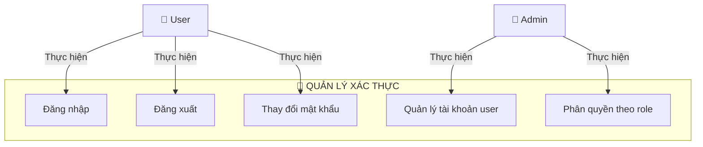
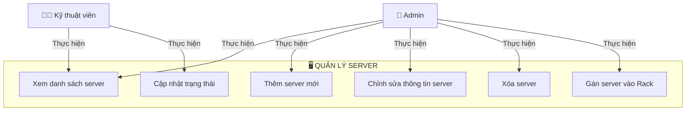
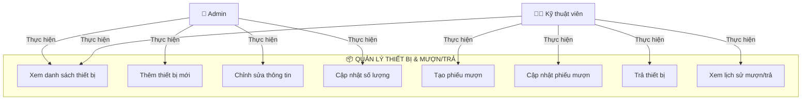
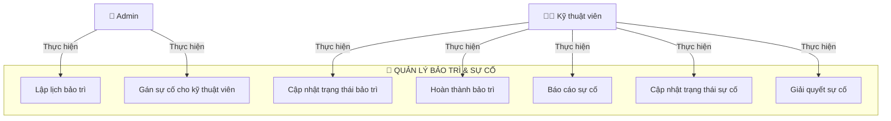
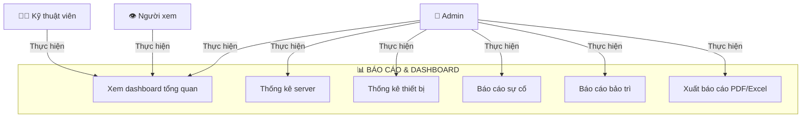
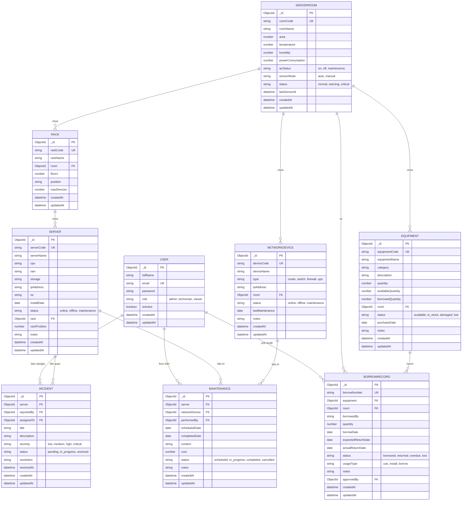

# PHÂN TÍCH HỆ THỐNG QUẢN LÝ PHÒNG SERVER

## I. TỔNG QUAN DỰ ÁN

**Tên dự án:** Hệ thống quản lý phòng server (QL Server)

**Mô tả:** Ứng dụng web quản lý toàn diện các tài nguyên IT trong phòng máy chủ, bao gồm server, thiết bị mạng, thiết bị phụ trợ, và các sự cố.

**Công nghệ:**
- Backend: Node.js + Express + MongoDB
- Frontend: React + Vite
- Database: MongoDB (NoSQL)

---

## II. CÁC THỰC THỂ CHÍNH (ENTITIES)

### 1. User (Người dùng)
- **fullName**: Tên đầy đủ
- **email**: Email đăng nhập
- **password**: Mật khẩu (mã hóa bcrypt)
- **role**: Admin / Technician / Viewer (3 vai trò)
- **isActive**: Trạng thái tài khoản
- **Mối quan hệ**: Liên kết với Incident, Maintenance, BorrowRecord

### 2. ServerRoom (Phòng máy chủ)
- **roomCode**: Mã phòng
- **roomName**: Tên phòng
- **area**: Diện tích
- **temperature**: Nhiệt độ
- **humidity**: Độ ẩm
- **powerConsumption**: Tiêu thụ điện năng
- **acStatus**: Trạng thái điều hòa (on/off/maintenance)
- **sensorMode**: Chế độ cảm biến (auto/manual)
- **status**: Trạng thái (normal/warning/critical)
- **Mối quan hệ**: Chứa nhiều Rack, Equipment, NetworkDevice

### 3. Rack (Tủ rack)
- **rackCode**: Mã tủ
- **rackName**: Tên tủ
- **floors**: Số tầng
- **position**: Vị trí
- **maxDevices**: Số thiết bị tối đa
- **room**: Liên kết ServerRoom
- **Mối quan hệ**: Chứa nhiều Server

### 4. Server (Máy chủ)
- **serverCode**: Mã server
- **serverName**: Tên server
- **cpu**: Thông số CPU
- **ram**: Thông số RAM
- **storage**: Lưu trữ
- **ipAddress**: Địa chỉ IP
- **os**: Hệ điều hành
- **installDate**: Ngày cài đặt
- **status**: Trạng thái (online/offline/maintenance)
- **rack**: Liên kết Rack
- **rackPosition**: Vị trí trong rack
- **Mối quan hệ**: Liên kết với Incident, Maintenance

### 5. NetworkDevice (Thiết bị mạng)
- **deviceCode**: Mã thiết bị
- **deviceName**: Tên thiết bị
- **type**: Loại (router/switch/firewall/ups)
- **ipAddress**: Địa chỉ IP
- **room**: Liên kết ServerRoom
- **status**: Trạng thái (online/offline/maintenance)
- **lastMaintenance**: Lần bảo trì cuối
- **Mối quan hệ**: Liên kết với Maintenance

### 6. Equipment (Thiết bị phụ trợ)
- **equipmentCode**: Mã thiết bị
- **equipmentName**: Tên thiết bị
- **category**: Loại (mouse, keyboard, monitor, ...)
- **quantity**: Số lượng
- **availableQuantity**: Số lượng còn lại
- **borrowedQuantity**: Số lượng mượn
- **room**: Liên kết ServerRoom
- **status**: Trạng thái (available/in_stock/damaged/lost)
- **purchaseDate**: Ngày mua
- **Mối quan hệ**: Liên kết với BorrowRecord

### 7. BorrowRecord (Phiếu mượn)
- **borrowNumber**: Số phiếu
- **equipment**: Liên kết Equipment
- **room**: Liên kết ServerRoom
- **borrowedBy**: Người mượn
- **quantity**: Số lượng
- **borrowDate**: Ngày mượn
- **expectedReturnDate**: Ngày trả dự kiến
- **actualReturnDate**: Ngày trả thực tế
- **status**: Trạng thái (borrowed/returned/overdue/lost)
- **usageType**: Loại sử dụng (use/install/borrow)
- **approvedBy**: Người phê duyệt

### 8. Maintenance (Bảo trì)
- **server**: Liên kết Server (tùy chọn)
- **networkDevice**: Liên kết NetworkDevice (tùy chọn)
- **performedBy**: Người thực hiện (User)
- **scheduledDate**: Ngày dự định
- **completedDate**: Ngày hoàn thành
- **content**: Nội dung bảo trì
- **cost**: Chi phí
- **status**: Trạng thái (scheduled/in_progress/completed/cancelled)

### 9. Incident (Sự cố)
- **server**: Liên kết Server
- **reportedBy**: Người báo cáo (User)
- **assignedTo**: Người phụ trách (User)
- **title**: Tiêu đề
- **description**: Mô tả
- **severity**: Mức độ (low/medium/high/critical)
- **status**: Trạng thái (pending/in_progress/resolved)
- **resolution**: Cách giải quyết
- **resolvedAt**: Thời gian giải quyết

### 10. Log (Nhật ký hệ thống)
- Ghi lại các hoạt động của người dùng
- Sử dụng cho audit trail

---

## III. USE CASE DIAGRAMS

### 3.1. USE CASE TOÀN HỆ THỐNG

```mermaid
graph TB
    subgraph System["🖥️ HỆ THỐNG QUẢN LÝ PHÒNG SERVER"]
        UC1["Quản lý xác thực"]
        UC2["Quản lý phòng server"]
        UC3["Quản lý server"]
        UC4["Quản lý tủ rack"]
        UC5["Quản lý thiết bị mạng"]
        UC6["Quản lý thiết bị phụ trợ"]
        UC7["Quản lý mượn/trả"]
        UC8["Quản lý bảo trì"]
        UC9["Quản lý sự cố"]
        UC10["Xem báo cáo"]
        UC11["Xem dashboard"]
        UC12["Quản lý AI Chat"]
    end
    
    subgraph Users["👥 CÁC VAI TRÒ"]
        Admin["👤 Admin"]
        Technician["👨‍🔧 Kỹ thuật viên"]
        Viewer["👁️ Người xem"]
    end
    
    Admin -->|Thực hiện| UC1
    Admin -->|Thực hiện| UC2
    Admin -->|Thực hiện| UC3
    Admin -->|Thực hiện| UC4
    Admin -->|Thực hiện| UC5
    Admin -->|Thực hiện| UC6
    Admin -->|Thực hiện| UC7
    Admin -->|Thực hiện| UC8
    Admin -->|Thực hiện| UC9
    Admin -->|Thực hiện| UC10
    Admin -->|Thực hiện| UC11
    Admin -->|Thực hiện| UC12
    
    Technician -->|Thực hiện| UC3
    Technician -->|Thực hiện| UC5
    Technician -->|Thực hiện| UC8
    Technician -->|Thực hiện| UC9
    Technician -->|Thực hiện| UC11
    Technician -->|Thực hiện| UC12
    
    Viewer -->|Thực hiện| UC10
    Viewer -->|Thực hiện| UC11
```



### 3.2. USE CASE: QUẢN LÝ XÁC THỰC



### 3.3. USE CASE: QUẢN LÝ SERVER



### 3.4. USE CASE: QUẢN LÝ THIẾT BỊ PHỤ TRỢ & MƯỢN/TRẢ



### 3.5. USE CASE: QUẢN LÝ BẢOTRÌ & SỰ CỐ



### 3.6. USE CASE: XEM BÁOCÁO & DASHBOARD



---

## IV. ENTITY RELATIONSHIP DIAGRAM (ERD)

### 4.1. ERD Model Chính



### 4.2. Sơ đồ Mối Quan Hệ (Text-based)

```
┌─────────────────┐
│      USER       │ (Admin, Technician, Viewer)
├─────────────────┤
│ • fullName      │
│ • email         │
│ • password      │
│ • role          │
│ • isActive      │
└────────┬────────┘
         │
         ├─→ báo cáo/gán ──→ INCIDENT
         ├─→ thực hiện ──→ MAINTENANCE
         └─→ phê duyệt ──→ BORROWRECORD


┌──────────────────┐
│   SERVERROOM     │ (Phòng máy chủ)
├──────────────────┤
│ • roomCode       │
│ • roomName       │
│ • temperature    │
│ • humidity       │
│ • acStatus       │
│ • status         │
└────────┬─────────┘
         │
         ├─→ chứa ──→ RACK
         ├─→ chứa ──→ EQUIPMENT
         ├─→ chứa ──→ NETWORKDEVICE
         └─→ có ──→ BORROWRECORD


┌──────────────────┐
│       RACK       │ (Tủ rack)
├──────────────────┤
│ • rackCode       │
│ • rackName       │
│ • floors         │
│ • maxDevices     │
└────────┬─────────┘
         │
         └─→ chứa (nhiều) ──→ SERVER


┌──────────────────┐
│      SERVER      │ (Máy chủ)
├──────────────────┤
│ • serverCode     │
│ • serverName     │
│ • cpu, ram       │
│ • ipAddress      │
│ • status         │
└────────┬─────────┘
         │
         ├─→ có ──→ INCIDENT
         └─→ bảo trì ──→ MAINTENANCE


┌──────────────────┐
│  NETWORKDEVICE   │ (Router, Switch, Firewall, UPS)
├──────────────────┤
│ • deviceCode     │
│ • deviceName     │
│ • type           │
│ • ipAddress      │
│ • status         │
└────────┬─────────┘
         │
         └─→ bảo trì ──→ MAINTENANCE


┌──────────────────┐
│    EQUIPMENT     │ (Thiết bị phụ trợ)
├──────────────────┤
│ • equipmentCode  │
│ • equipmentName  │
│ • quantity       │
│ • status         │
└────────┬─────────┘
         │
         └─→ mượn ──→ BORROWRECORD


┌──────────────────┐
│  BORROWRECORD    │ (Phiếu mượn/trả)
├──────────────────┤
│ • borrowNumber   │
│ • quantity       │
│ • borrowDate     │
│ • returnDate     │
│ • status         │
└──────────────────┘


┌──────────────────┐
│     INCIDENT     │ (Sự cố)
├──────────────────┤
│ • title          │
│ • description    │
│ • severity       │
│ • status         │
│ • resolution     │
└──────────────────┘


┌──────────────────┐
│   MAINTENANCE    │ (Bảo trì)
├──────────────────┤
│ • scheduledDate  │
│ • completedDate  │
│ • content        │
│ • cost           │
│ • status         │
└──────────────────┘
```

---

## V. HƯỚNG DẪN VẼ USE CASE DIAGRAM

### Bước 1: Xác định Actors (Người/Hệ thống)
- **Admin**: Quản trị viên hệ thống
- **Technician**: Kỹ thuật viên IT
- **Viewer**: Người xem báo cáo
- **Hệ thống**: Có thể gửi thông báo, cảnh báo

### Bước 2: Xác định các Use Case chính
Mỗi chức năng lớn được chia thành các use case nhỏ:
- **Đăng nhập/Xác thực**
- **CRUD Operations** (Create, Read, Update, Delete) cho từng đối tượng
- **Quản lý trạng thái** (State transitions)
- **Báo cáo & Thống kê**

### Bước 3: Vẽ các mối quan hệ
- **Actor → Use Case**: Mũi tên solid (—→)
- **Use Case → Use Case**: 
  - `<<include>>`: Use case bắt buộc phải gọi
  - `<<extend>>`: Use case có thể được gọi thêm
  - `<<generalization>>`: Kế thừa

### Bước 4: Sắp xếp trực quan
- Actors ở bên trái
- System boundary (hình chữ nhật) ở giữa
- Use cases bên trong
- Các extension case bên ngoài

---

## VI. HƯỚNG DẪN VẼ ERD MODEL

### Bước 1: Xác định các Entities
Các entity chính đã được liệt kê ở mục II

### Bước 2: Xác định các Attributes
Mỗi entity có các thuộc tính (properties)
- **PK (Primary Key)**: Khóa chính (_id)
- **FK (Foreign Key)**: Khóa ngoại (liên kết với entity khác)
- **UK (Unique Key)**: Khóa duy nhất (không trùng lặp)

### Bước 3: Xác định các Relationships
**Các loại quan hệ:**
- **One-to-One (1:1)**: 1 entity liên kết với 1 entity khác
- **One-to-Many (1:N)**: 1 entity liên kết với nhiều entity khác
  - Ví dụ: ServerRoom (1) —— chứa (N) Equipment
- **Many-to-Many (N:M)**: Cần bảng junction table
  - Ví dụ: User (N) —— quản lý (M) Server

**Cardinality:**
```
||  ---  o{   =  One-to-Many
||  ---  ||   =  One-to-One
o{  ---  o{   =  Many-to-Many
```

### Bước 4: Vẽ ERD
**Cách vẽ tay:**
1. Vẽ các hình chữ nhật cho entities
2. Liệt kê attributes trong mỗi hộp
3. Vẽ các đường kết nối giữa entities
4. Ghi rõ cardinality trên đường kết nối
5. Ghi tên mối quan hệ trên đường

**Công cụ trực tuyến:**
- Draw.io
- Lucidchart
- Miro
- Figma

---

## VII. CÁC QUYẾT ĐỊNH THIẾT KẾ QUAN TRỌNG

### 7.1. Database Design
- Sử dụng **MongoDB** (NoSQL)
- Các collection tương ứng với entities
- Sử dụng references (ObjectId) thay vì embedding để tránh redundancy

### 7.2. Authentication & Authorization
- **JWT (JSON Web Tokens)** cho xác thực
- **Role-Based Access Control (RBAC)**:
  - Admin: Toàn quyền
  - Technician: Quản lý tài nguyên, xử lý sự cố
  - Viewer: Chỉ xem báo cáo

### 7.3. Status Management
- Mỗi entity quan trọng có **status field**
- Các trạng thái được định nghĩa rõ ràng (enum)
- Hỗ trợ state machine cho workflow

### 7.4. Timestamps
- Tất cả entities có `createdAt` và `updatedAt`
- Dùng cho audit trail

### 7.5. Validation
- Server-side validation bắt buộc
- Unique constraints (roomCode, serverCode, etc.)
- Min/Max validations

---

## VIII. LUỒNG HOẠT ĐỘNG CHÍNH

### 8.1. Luồng Đăng Nhập
```
User nhập email/password
    ↓
Server xác thực credentials
    ↓
Tạo JWT token
    ↓
Trả về token cho client
    ↓
Client lưu token
    ↓
Các request sau gửi kèm token
```

### 8.2. Luồng Tạo Phiếu Mươi
```
Technician mở form mượn
    ↓
Chọn thiết bị & số lượng
    ↓
Nhập thông tin mượn
    ↓
Gửi request
    ↓
Server cập nhật:
  - Tạo BorrowRecord
  - Cập nhật availableQuantity trong Equipment
  - Cập nhật borrowedQuantity
    ↓
Trả về phiếu số
```

### 8.3. Luồng Báo Cáo Sự Cố
```
Technician phát hiện sự cố
    ↓
Mở form báo cáo
    ↓
Nhập title, description, severity
    ↓
Chọn server liên quan
    ↓
Gửi
    ↓
Server tạo Incident record
    ↓
Admin được thông báo
    ↓
Admin gán cho technician xử lý
```

---

## IX. CÔNG NGHỆ & CÔNG CỤ ĐỀ XUẤT

### Vẽ Use Case Diagram:
1. **Lucidchart** - Chuyên dụng, dễ sử dụng
2. **Draw.io** - Miễn phí, open-source
3. **StarUML** - Chuyên dụng UML
4. **Miro** - Cộng tác team
5. **Mermaid** (dòng text trong markdown)

### Vẽ ERD:
1. **Lucidchart** - Chuyên dụng
2. **DbDiagram.io** - Chuyên dụng cho DB
3. **Miro** - Cộng tác team
4. **Draw.io** - Miễn phí
5. **MySQL Workbench** - Cho MySQL

---

## X. CÓ THỂPHÁT TRIỂN THÊM

1. **Monitoring**: Real-time monitoring server status
2. **Alerting**: Cảnh báo khi nhiệt độ vượt ngưỡng
3. **Integration**: Kết nối với các API bên ngoài
4. **Mobile App**: Ứng dụng mobile iOS/Android
5. **Cloud Deployment**: Triển khai trên AWS/Azure
6. **Advanced Analytics**: Machine learning cho predictions
7. **CMDB**: Configuration Management Database

---

**Tài liệu này được tạo để hỗ trợ thiết kế hệ thống và phát triển dự án QL Server.**
